# LURE — Browser Phishing Defence Platform

A browser-native phishing defence platform built for SOC teams. 49 real-time detection modules in a Chrome MV3 extension covering the full phishing kill chain — from delivery through credential harvest to persistence — paired with a Python email analysis CLI that produces verdicts from raw `.eml` files.

The extension ships with a canvas-based live threat visualization dashboard (LURE UI) showing real-time detection packet flows color-coded by severity.

## Architecture

```mermaid
graph TB
    subgraph "Chrome Extension — 49 Detectors, 25 Waves"
        SW[Service Worker<br/>Message Router + Triage Engine] --> W1[Wave 1–3: Foundation<br/>OAuthGuard · DataEgress · ExtensionAuditor · AgentIntentGuard]
        SW --> W2[Wave 4–6: Interaction Layer<br/>AutofillGuard · ClipboardDefender · FullscreenGuard<br/>PasskeyGuard · QRLjackingGuard]
        SW --> W3[Wave 7–9: Social Engineering<br/>WebRTCGuard · ScreenShareGuard · PhishVision<br/>ProxyGuard · SyncGuard · FakeSender]
        SW --> W4[Wave 10–12: Evasion<br/>CTAPGuard · IPFSGuard · LLMScorer<br/>VNCGuard · PWAGuard · TPASentinel]
        SW --> W5[Wave 13–15: Exfil + Persistence<br/>DrainerGuard · StyleAuditor · WsExfilGuard<br/>SwGuard · EtherHidingGuard · NotificationGuard]
        SW --> W6[Wave 16–19: Next-Gen<br/>WebTransportGuard · CanvasPhishGuard<br/>CanvasKeystrokeGuard · CanvasExfilGuard<br/>SpeculationRulesGuard]
        SW --> W7[Wave 20–21: Anti-Fingerprinting + Payment<br/>StealthKit · ProbeGuard · PaymentRequestGuard]
        SW --> W8[Wave 22–23: File System + Threat Intel<br/>FileSystemGuard · ThreatIntelSync]
        SW --> W9[Wave 24–25: SPA + Deepfake Sentinel<br/>SPANavigationMonitor · WebRTCSyntheticTrack]
    end

    subgraph "Lure CLI — Email Analysis Pipeline"
        EML[.eml / .msg] --> PA[Stage A: Parser<br/>SPF · DKIM · DMARC · Routing]
        PA --> PB[Stage B: Extractor<br/>URLs · IPs · Domains · Hashes]
        PB --> PC[Stage C: YARA Scanner<br/>8 custom rules]
        PC --> PE[Stage E: Scorer<br/>11 weighted signals]
        PE --> V{Verdict}
    end

    subgraph "Intelligence Layer"
        SW --> TRI[Triage Engine<br/>NIST 800-61r3 · MITRE ATT&CK]
        SW --> INT[Intelligence Lifecycle<br/>35 PIRs · 31 Correlation Sets]
        SW --> TIS[ThreatIntelSync<br/>PhishStats API · phishnet.cc]
        SW --> TEL[Telemetry<br/>chrome.storage.local]
        TEL --> POP[LURE Dashboard<br/>Canvas Visualization]
        TEL -.->|Production| DCR[Azure Monitor DCR]
    end
```



## Detector Inventory

49 detectors across 25 implementation waves, each with additive signal scoring (alert at 0.50, block at 0.70, cap 1.0).

| Wave | Detector | Threat | MITRE ATT&CK | Injection |
|------|----------|--------|--------------|-----------|
| 1 | OAuthGuard — Device Code Flow | Storm-2372 | T1528 | background |
| 1 | OAuthGuard — State Parameter Abuse | Storm-2372 | T1598.004 | background |
| 2 | DataEgressMonitor — Blob Credential | NOBELIUM / TA4557 | T1027.006 | programmatic |
| 3 | ExtensionAuditor — DNR Audit | QuickLens | T1195.002 | background |
| 3 | ExtensionAuditor — Ownership Drift | Cyberhaven-style | T1195.002 | background |
| 3 | ExtensionAuditor — C2 Polling | Multiple | T1071.001 | background |
| 3 | AgentIntentGuard — GAN Page + Guardrail Bypass | Agentic | T1056.003 | document_idle |
| 4 | AutofillGuard — Hidden Field Harvest | Kuosmanen-class | T1056.003 | document_idle |
| 4 | AutofillGuard — Extension Clickjack | Toth-class | T1056.003 | document_idle |
| 5 | ClipboardDefender — ClickFix Injection | FIN7 / Lazarus | T1059.001 | document_start |
| 5 | FullscreenGuard — BitM Overlay | BitM-class | T1185 | document_idle |
| 6 | PasskeyGuard — Credential Interception | Spensky DEF CON 33 | T1556.006 | document_start |
| 6 | QRLjackingGuard — Session Hijack | APT29 / TA2723 | T1539 | document_idle |
| 7 | WebRTCGuard — Virtual Camera | Scattered Spider | T1566.003 | document_start |
| 7 | ScreenShareGuard — TOAD Detection | MuddyWater / Luna Moth | T1113 | document_start |
| 8 | PhishVision — Brand Impersonation + Favicon Hash | Multiple | T1566.002 | document_idle |
| 8 | ProxyGuard — AiTM Proxy | Evilginx / Modlishka | T1557.003 | document_idle |
| 9 | SyncGuard — Browser Sync Hijack | Scattered Spider | T1078.004 | document_idle |
| 9 | FakeSender — Helpdesk Impersonation | Multiple | T1566.002 | document_idle |
| 10 | CTAPGuard — FIDO Downgrade | Tycoon 2FA | T1556.006 | document_idle |
| 10 | IPFSGuard — Gateway Phishing | Commodity | T1583.006 | document_idle |
| 11 | LLMScorer — AI-Generated Phishing | TA4557 / Scattered Spider | T1566.002 | document_idle |
| 11 | VNCGuard — EvilnoVNC AiTM | Storm-1811 / TA577 | T1557.003 | document_idle |
| 12 | PWAGuard — Progressive Web App Phishing | Czech/Hungarian campaigns | T1036.005 | document_idle |
| 12 | TPASentinel — Consent Phishing | Storm-0324 / APT29 | T1528 | document_idle |
| 13 | DrainerGuard — Crypto Wallet Drainer | Inferno / Angel / Pink | T1656 | document_idle |
| 13 | StyleAuditor — CSS Credential Exfil | Advanced kits | T1056.003 | document_idle |
| 14 | WsExfilGuard — WebSocket Credential Exfil | EvilProxy / Modlishka 2.0+ | T1056.003 | document_start |
| 14 | SwGuard — Service Worker Persistence | Watering-hole campaigns | T1176 | document_start |
| 15 | EtherHidingGuard — Blockchain Payload Delivery | ClearFake / ClickFix | T1059.007 | document_start |
| 15 | NotificationGuard — Push Notification Phishing | Multiple | T1204.001 | document_start |
| 16 | WebTransportGuard — WebTransport AiTM Relay | Advanced PhaaS kits | T1056.003 | document_start |
| 17 | CanvasPhishGuard — Canvas Credential Phishing | Advanced kits / Flutter Web | T1056.003 | document_idle |
| 18 | CanvasKeystrokeGuard — Canvas Keystroke Capture | Advanced kits / Flutter Web | T1056.003 | document_start (MAIN world) |
| 18 | CanvasExfilGuard — Canvas Credential Exfiltration | Advanced kits / Flutter Web | T1041 | document_start |
| 19 | SpeculationRulesGuard — Speculation Rules Phishing | XSS → Prerender abuse | T1598.003 | document_start |
| 20 | StealthKit — Anti-Fingerprinting Hardening | Detection evasion | — | document_start (MAIN world) |
| 20 | ProbeGuard — Security Tool Probing Detection | Tycoon 2FA / EvilProxy / CreepJS | T1518.001 | document_start (MAIN world) |
| 21 | PaymentRequestGuard — Payment API Phishing Signal | PII harvesting via browser-native UI | T1056.003 | document_start (MAIN world) |
| 22 | FileSystemGuard — File System Access API Abuse | RøB-style ransomware / PhaaS kits | T1552.001 | document_start (MAIN world) |
| 23 | ThreatIntelSync — Domain Reputation Check | Confirmed phishing infrastructure | T1566.002 | background (alarm-based) |
| 24 | SPANavigationMonitor — SPA Login Path Injection | XSS/Nav API pushState phishing | T1185 | background |
| 25 | WebRTCSyntheticTrackSentinel — Deepfake Track Injection | Scattered Spider / state actors | T1566.003 | document_start (MAIN world) |

## Signal Scoring Model

Every detector uses the same additive scoring framework:

- Each signal contributes a weight (0.10–0.40)
- Signals are summed, capped at 1.0
- **Severity**: >= 0.90 Critical, >= 0.70 High, >= 0.50 Medium
- **Action**: >= 0.70 blocked (fields disabled, banner injected), >= 0.50 alerted

Example from WebTransportGuard:

| Signal | Weight | Trigger |
|--------|--------|---------|
| `wt:transport_on_credential_page` | +0.40 | WebTransport connection on page with credential fields |
| `wt:self_signed_cert_hashes` | +0.30 | `serverCertificateHashes` option used (self-signed certs) |
| `wt:cross_origin_transport_with_creds` | +0.25 | WebTransport target hostname differs from page origin |
| `wt:credential_data_in_stream` | +0.20 | Input field value found in stream/datagram write |
| `wt:transport_without_media_context` | +0.15 | WebTransport without video/streaming UI |

## Intelligence Layer

Every detection event is enriched by three engines before persistence:

**Triage Engine** (`lib/triage.js`) — NIST SP 800-61r3 classification with MITRE ATT&CK mapping, SANS PICERL priority/SLA assignment, and recommended containment actions per event type.

**Intelligence Lifecycle** (`lib/intelligence_lifecycle.js`) — 35 Priority Intelligence Requirements (PIRs), confidence scoring, deduplication, 31 correlation sets for campaign grouping, and tactical intelligence summary generation.

**ThreatIntelSync** (`lib/threat_intel_sync.js`) — Periodic ingestion from PhishStats API and phishnet.cc feed.txt. Builds compact domain/IP/exfil-endpoint lookup sets stored in `chrome.storage.local['threatIntel']`, refreshed every 4 hours via `chrome.alarms`. All lookups are supplementary — core detection quality never degrades if feeds are unreachable.

## Quick Start

### Chrome Extension

```bash
git clone <repo-url>
cd lur3

# Load in Chrome or Brave:
# 1. Navigate to chrome://extensions (or brave://extensions)
# 2. Enable "Developer mode"
# 3. Click "Load unpacked" → select the extension/ directory
```

### Run Tests

```bash
# Extension tests (Vitest) — 1439 tests across 40 suites
cd extension && npm test

# Lure CLI tests (pytest)
cd lure && pip install -e ".[dev,yara]" && pytest -v
```

## LURE Dashboard

The popup renders a live canvas visualization of all detection events. Packets travel along bezier thread paths, color-coded by severity:

- **Olive** (`#8b9e73`) — normal / low / medium traffic
- **Bronze** (`#b59a6d`) — high severity detections
- **Red** (`#c25e5e`) — critical detections with glow

Each threat packet carries a label showing the detector name and key detail (e.g. `AiTM Proxy: evilginx.example.com`, `FS API Credential Exfil: .aws, .env`).

## Lure CLI

Email analysis pipeline producing categorical verdicts from raw `.eml` files.

| Stage | Module | What It Does |
|-------|--------|-------------|
| A | `parser.py` | Parse RFC 5322 / OLE .msg, validate SPF/DKIM/DMARC, walk Received chain |
| B | `extractor.py` | Extract URLs, IPs, domains, hashes, emails, crypto wallets |
| C | `scanner.py` | YARA scanning with 8 custom rules |
| E | `scorer.py` | 11 weighted signals producing categorical verdicts |

## Project Structure

```
lur3/
├── extension/                  # Chrome MV3 extension
│   ├── manifest.json           # v1.0.0, 47 detectors, alarms permission
│   ├── background/             # Service worker (Wave 1–25 message routing + ThreatIntelSync)
│   ├── content/                # 40 content scripts
│   ├── lib/                    # triage.js · intelligence_lifecycle.js · telemetry.js
│   │                           # stealth_kit.js · threat_intel_sync.js
│   ├── popup/                  # LURE canvas visualization dashboard
│   └── tests/                  # 40 Vitest test files, 1439 tests
│
├── lure/                       # Email analysis CLI
│   ├── lure/modules/           # parser, extractor, scanner, scorer
│   ├── rules/                  # YARA rule files
│   └── tests/                  # pytest tests
│
├── Research/                   # Threat research and detector design docs
├── Plans/                      # Architecture and implementation planning docs
├── CUTTING_EDGE_DETECTORS.md   # Next-gen detection candidates
├── RESEARCH_PROMPTS.md         # Structured research prompts
└── THREAT_INTELLIGENCE.md      # Detector → threat intel source mapping
```

## Threat Intelligence Sources

See [THREAT_INTELLIGENCE.md](THREAT_INTELLIGENCE.md) for the complete mapping of every detector to its primary threat intelligence source.

See [CUTTING_EDGE_DETECTORS.md](CUTTING_EDGE_DETECTORS.md) for research on next-generation detection candidates.

## What's Not Included (by design)

- **Azure Monitor DCR integration** — requires infrastructure. Telemetry architecture is documented; local storage stub demonstrates the full pipeline.
- **Chrome Web Store publication** — sideload is sufficient for review.
- **Favicon hash map populated** — `FAVICON_HASH_TO_BRAND` in PhishVision ships empty. Infrastructure is complete; hashes are collected operationally using the DevTools script in the source comments.
- **urlscan.io reactive enrichment** — Tier 2 integration (requires API key). Architecture designed; deferred per design constraints.
