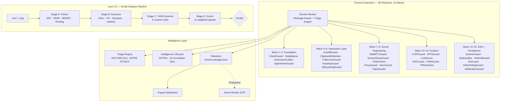

# PhishOps Security Suite

A browser-native phishing defence platform built for SOC teams. 38 real-time detection modules in a Chrome MV3 extension covering the full phishing kill chain — from delivery through credential harvest to persistence — paired with a Python email analysis CLI that produces verdicts from raw `.eml` files.

## Architecture



## Detector Inventory

38 detectors across 15 implementation waves, each with additive signal scoring (alert at 0.50, block at 0.70, cap 1.0).

| Wave | Detector | Threat | MITRE ATT&CK | Injection |
|------|----------|--------|--------------|-----------|
| 1 | OAuthGuard — Device Code Flow | Storm-2372 | T1528 | background |
| 1 | OAuthGuard — State Parameter Abuse | Storm-2372 | T1598.004 | background |
| 2 | DataEgressMonitor — Blob Credential | NOBELIUM / TA4557 | T1027.006 | programmatic |
| 3 | ExtensionAuditor — DNR Audit | QuickLens | T1195.002 | background |
| 3 | ExtensionAuditor — Ownership Drift | Cyberhaven-style | T1195.002 | background |
| 3 | ExtensionAuditor — C2 Polling | Multiple | T1071.001 | background |
| 3 | AgentIntentGuard — GAN Page + Guardrail Bypass | Agentic | T1056.003 | document_idle |
| 4 | AutofillGuard — Hidden Field Harvest | Kuosmanen-class | T1056.003 | document_idle |
| 4 | AutofillGuard — Extension Clickjack | Toth-class | T1056.003 | document_idle |
| 5 | ClipboardDefender — ClickFix Injection | FIN7 / Lazarus | T1059.001 | document_start |
| 5 | FullscreenGuard — BitM Overlay | BitM-class | T1185 | document_idle |
| 6 | PasskeyGuard — Credential Interception | Spensky DEF CON 33 | T1556.006 | document_start |
| 6 | QRLjackingGuard — Session Hijack | APT29 / TA2723 | T1539 | document_idle |
| 7 | WebRTCGuard — Virtual Camera | Scattered Spider | T1566.003 | document_start |
| 7 | ScreenShareGuard — TOAD Detection | MuddyWater / Luna Moth | T1113 | document_start |
| 8 | PhishVision — Brand Impersonation | Multiple | T1566.002 | document_idle |
| 8 | ProxyGuard — AiTM Proxy | Evilginx / Modlishka | T1557.003 | document_idle |
| 9 | SyncGuard — Browser Sync Hijack | Scattered Spider | T1078.004 | document_idle |
| 9 | FakeSender — Helpdesk Impersonation | Multiple | T1566.002 | document_idle |
| 10 | CTAPGuard — FIDO Downgrade | Tycoon 2FA | T1556.006 | document_idle |
| 10 | IPFSGuard — Gateway Phishing | Commodity | T1583.006 | document_idle |
| 11 | LLMScorer — AI-Generated Phishing | TA4557 / Scattered Spider | T1566.002 | document_idle |
| 11 | VNCGuard — EvilnoVNC AiTM | Storm-1811 / TA577 | T1557.003 | document_idle |
| 12 | PWAGuard — Progressive Web App Phishing | Czech/Hungarian campaigns | T1036.005 | document_idle |
| 12 | TPASentinel — Consent Phishing | Storm-0324 / APT29 | T1528 | document_idle |
| 13 | DrainerGuard — Crypto Wallet Drainer | Inferno / Angel / Pink | T1656 | document_idle |
| 13 | StyleAuditor — CSS Credential Exfil | Advanced kits | T1056.003 | document_idle |
| 14 | WsExfilGuard — WebSocket Credential Exfil | EvilProxy / Modlishka 2.0+ | T1056.003 | document_start |
| 14 | SwGuard — Service Worker Persistence | Watering-hole campaigns | T1176 | document_start |
| 15 | EtherHidingGuard — Blockchain Payload Delivery | ClearFake / ClickFix | T1059.007 | document_start |
| 15 | NotificationGuard — Push Notification Phishing | Multiple | T1204.001 | document_start |

## Signal Scoring Model

Every detector uses the same additive scoring framework:

- Each signal contributes a weight (0.10–0.40)
- Signals are summed, capped at 1.0
- **Severity**: >= 0.90 Critical, >= 0.70 High, >= 0.50 Medium
- **Action**: >= 0.70 blocked (fields disabled, banner injected), >= 0.50 alerted

Example from EtherHidingGuard:

| Signal | Weight | Trigger |
|--------|--------|---------|
| `etherhide:rpc_call_to_blockchain_endpoint` | +0.40 | fetch/XHR POST to BSC/ETH RPC with eth_call |
| `etherhide:eth_call_response_injected` | +0.30 | Decoded ABI response found in DOM injection |
| `etherhide:contract_address_in_inline_script` | +0.25 | 0x + 40 hex + RPC method in inline script |
| `etherhide:web3_library_on_non_dapp` | +0.20 | ethers.js/web3.js without DApp UI |
| `etherhide:dynamic_script_from_rpc_response` | +0.15 | Dynamic script content matches RPC response |

## Intelligence Layer

Every detection event is enriched by two engines before persistence:

**Triage Engine** (`lib/triage.js`) — NIST SP 800-61r3 classification with MITRE ATT&CK mapping, SANS PICERL priority/SLA assignment, and recommended containment actions per event type.

**Intelligence Lifecycle** (`lib/intelligence_lifecycle.js`) — 29 Priority Intelligence Requirements (PIRs), confidence scoring, deduplication, 23 correlation sets for campaign grouping, and tactical intelligence summary generation.

## Quick Start

### Chrome Extension

```bash
git clone <repo-url>
cd lur3

# Load in Chrome:
# 1. Navigate to chrome://extensions
# 2. Enable "Developer mode"
# 3. Click "Load unpacked" → select the extension/ directory
```

### Run Tests

```bash
# Extension tests (Vitest) — 676 tests across 20 passing suites
npx vitest run extension/__tests__/

# Lure tests (pytest)
cd lure && pip install -e ".[dev,yara]" && pytest -v
```

## Lure CLI

Email analysis pipeline producing categorical verdicts from raw `.eml` files.

| Stage | Module | What It Does |
|-------|--------|-------------|
| A | `parser.py` | Parse RFC 5322 / OLE .msg, validate SPF/DKIM/DMARC, walk Received chain |
| B | `extractor.py` | Extract URLs, IPs, domains, hashes, emails, crypto wallets |
| C | `scanner.py` | YARA scanning with 8 custom rules |
| E | `scorer.py` | 11 weighted signals producing categorical verdicts |

## Project Structure

```
lur3/
├── extension/                  # Chrome MV3 extension
│   ├── manifest.json           # v1.0.0, 38 detectors
│   ├── background/             # Service worker (Wave 1–15 message routing)
│   ├── content/                # 26 content scripts
│   ├── lib/                    # triage.js, intelligence_lifecycle.js, telemetry.js
│   ├── popup/                  # Dashboard UI (Dieter Rams / Braun design)
│   └── __tests__/              # 28 Vitest test files, 676 passing tests
│
├── lure/                       # Email analysis CLI
│   ├── lure/modules/           # parser, extractor, scanner, scorer
│   ├── rules/                  # YARA rule files
│   └── tests/                  # pytest tests
│
├── CUTTING_EDGE_DETECTORS.md   # Brainstorm — next-gen detection candidates
└── THREAT_INTELLIGENCE.md      # Detector → threat intel source mapping
```

## Threat Intelligence Sources

See [THREAT_INTELLIGENCE.md](THREAT_INTELLIGENCE.md) for the complete mapping of every detector to its primary threat intelligence source.

See [CUTTING_EDGE_DETECTORS.md](CUTTING_EDGE_DETECTORS.md) for research on next-generation detection candidates.

## What's Not Included (by design)

- **Azure Monitor DCR integration** — requires infrastructure. Telemetry architecture is documented; local storage stub demonstrates the full pipeline.
- **Chrome Web Store publication** — sideload is sufficient for review.
- **Enrichment APIs** (VirusTotal, AbuseIPDB) — requires API keys. Enrichment stage is wired but gracefully skips when keys are absent.
