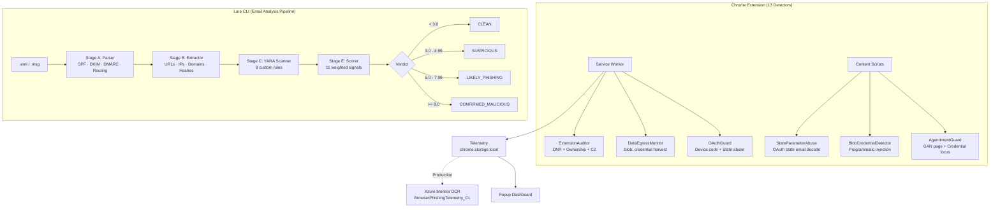

# PhishOps Security Suite

A browser-native phishing defence platform and email analysis CLI built for SOC teams. 13 detection modules covering OAuth abuse, HTML smuggling, extension supply chain attacks, clipboard injection, and agentic guardrails — backed by a Python pipeline that produces verdicts from raw `.eml` files.

## Architecture



## Modules

### Chrome Extension

| Module | Detectors | Threat Actor / TTP |
|--------|-----------|-------------------|
| **OAuthGuard** | Device code flow interception, State parameter email encoding | Storm-2372 (Microsoft, March 2026) |
| **DataEgressMonitor** | blob: URL credential page detection, HTML smuggling terminal page | NOBELIUM, TA4557, GhostSpider (Mandiant 2025) |
| **ExtensionAuditor** | DNR header stripping audit, Ownership drift detection, C2 polling | QuickLens supply chain (Feb 2026), Cyberhaven compromise |
| **AgentIntentGuard** | GAN-optimised page heuristic, Credential focus monitoring | Agentic phishing guardrail bypass |
| **ClipboardDefender** | ClickFix clipboard injection detection | ClickFix malware delivery (Proofpoint 2025) |

### Lure CLI

| Stage | Module | What It Does |
|-------|--------|-------------|
| A | `parser.py` | Parse RFC 5322 / OLE .msg, validate SPF/DKIM/DMARC, walk Received chain, detect homograph domains |
| B | `extractor.py` | Extract URLs, IPs, domains, hashes, emails, crypto wallets from body + HTML + attachments |
| C | `scanner.py` | YARA scanning with 8 custom rules (ClickFix, Tycoon 2FA, device code, HTML smuggling, macro) |
| E | `scorer.py` | 11 weighted signals producing categorical verdicts with configurable thresholds |

## Quick Start

### Chrome Extension

```bash
# Clone and load unpacked
git clone https://github.com/your-username/phishops.git
cd phishops

# Load in Chrome:
# 1. Navigate to chrome://extensions
# 2. Enable "Developer mode"
# 3. Click "Load unpacked" → select the extension/ directory
# 4. Open demo pages to trigger detectors:
#    extension/demo/clickfix.html
#    extension/demo/oauth-consent.html
#    extension/demo/blob-credential.html
```

### Lure CLI

```bash
cd lure

# Install with all extras
pip install -e ".[dev,yara]"

# Analyze an email
lure analyze tests/samples/spf_fail.eml

# JSON output
lure analyze email.eml --format json --output report.json

# Validate configuration
lure config validate

# Batch analysis
lure batch ./email_directory/
```

### Run Tests

```bash
# Extension tests (Vitest)
cd extension
npm install
npm test

# Lure tests (pytest)
cd lure
pip install -e ".[dev,yara]"
pytest -v
```

## Scoring Signals

| Signal | Weight | Trigger |
|--------|--------|---------|
| `SPF_FAIL` | 2.0 | SPF authentication failed |
| `DKIM_FAIL` | 1.5 | DKIM signature verification failed |
| `DMARC_FAIL` | 2.0 | DMARC policy evaluation failed |
| `REPLY_TO_MISMATCH` | 2.5 | Reply-To domain differs from From domain |
| `HOMOGRAPH_DOMAIN` | 4.0 | Mixed Unicode scripts in sender domain |
| `SUSPICIOUS_ATTACHMENT` | 3.0 | Macro or PDF with suspicious elements |
| `URL_SHORTENER` | 1.0 | URL shortener domain in email |
| `SUSPICIOUS_TLD` | 1.5 | Domain with high-risk TLD (.xyz, .tk, etc.) |
| `MANY_ANOMALIES` | 1.0 | 3+ header anomalies detected |
| `NO_AUTH_HEADERS` | 1.5 | No SPF/DKIM/DMARC results present |
| `YARA_MATCH` | 4.0 | YARA rule match on email content |

## YARA Rules

8 custom rules in `lure/rules/phishing_custom.yar`:

- `phishops_clickfix_clipboard_lure` — ClickFix Win+R social engineering
- `phishops_tycoon2fa_kit` — Tycoon 2FA AiTM kit fingerprinting
- `phishops_device_code_lure` — Storm-2372 device code phishing text
- `phishops_html_smuggling_loader` — atob() + Blob payload delivery
- `phishops_credential_harvest_form` — Password field + external action + brand
- `phishops_qr_code_phishing` — Quishing with urgency + MFA lure
- `phishops_vba_macro_downloader` — AutoOpen + download/exec macro
- `phishops_base64_encoded_url` — Base64-encoded URL obfuscation

## Project Structure

```
phishops/
├── extension/                  # Chrome MV3 extension (unified)
│   ├── manifest.json           # v1.0.0, 13 detectors
│   ├── background/             # Merged service worker (Wave 1-3)
│   ├── content/                # Content scripts
│   ├── lib/                    # Shared telemetry module
│   ├── popup/                  # Dashboard UI
│   ├── demo/                   # Interactive demo pages
│   └── __tests__/              # Vitest tests
│
├── lure/                       # Email analysis CLI
│   ├── lure/
│   │   ├── cli.py              # Typer CLI entrypoint
│   │   ├── pipeline.py         # 6-stage orchestrator
│   │   ├── config.py           # Pydantic settings
│   │   ├── models.py           # All data models
│   │   └── modules/
│   │       ├── parser.py       # Stage A: Header forensics
│   │       ├── extractor.py    # Stage B: IOC extraction
│   │       ├── scanner.py      # Stage C: YARA scanning
│   │       └── scorer.py       # Stage E: Verdict scoring
│   ├── rules/                  # YARA rule files
│   └── tests/                  # pytest tests
│
├── wave1/                      # Original Wave 1 source (ProxyGuard + OAuthGuard)
├── wave2/                      # Original Wave 2 source (DataEgressMonitor)
└── wave3/                      # Original Wave 3 source (ExtensionAuditor + AgentIntentGuard)
```

## Threat Intelligence Sources

See [THREAT_INTELLIGENCE.md](THREAT_INTELLIGENCE.md) for the complete mapping of every detector to its primary threat intelligence source.

## What's Not Included (by design)

- **Azure Monitor DCR integration** — requires infrastructure. Telemetry architecture is documented in code comments; the local storage stub demonstrates the full pipeline.
- **Chrome Web Store publication** — sideload is sufficient for review.
- **Enrichment APIs** (VirusTotal, AbuseIPDB, etc.) — requires API keys reviewers won't have. The enrichment stage is wired but gracefully skips when keys are absent.
- **LLM verdict explanation** — requires Ollama running locally. Wired but optional.
